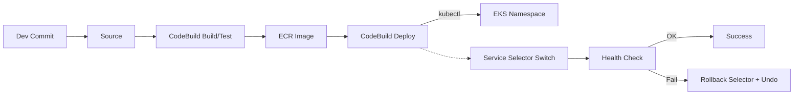
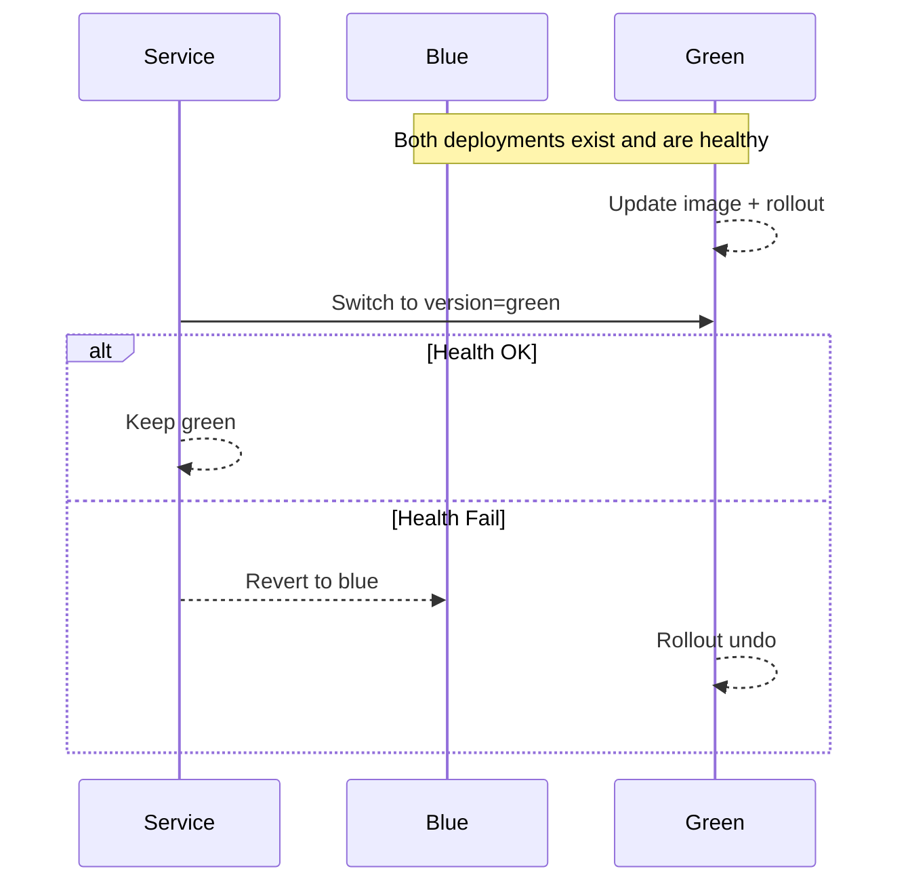

# 🏗️ Flask App - Complete Architecture Overview

## 📊 System Architecture Diagram

```
┌─────────────────────────────────────────────────────────────────────────────────────────────────┐
│                                    🌐 INTERNET / USERS                                           │
└─────────────────────┬───────────────────────────────────────────────────────────────────────────┘
                      │
                      ▼
┌─────────────────────────────────────────────────────────────────────────────────────────────────┐
│                              🔒 AWS Application Load Balancer (ALB)                              │
│                              • SSL/TLS Termination                                                │
│                              • Health Checks                                                      │
│                              • WAF Protection                                                     │
└─────────────────────┬───────────────────────────────────────────────────────────────────────────┘
                      │
                      ▼
┌─────────────────────────────────────────────────────────────────────────────────────────────────┐
│                              ☸️  AWS EKS CLUSTER                                                 │
│  ┌─────────────────────────────────────────────────────────────────────────────────────────┐   │
│  │                          🏢 PUBLIC SUBNETS                                               │   │
│  │  ┌─────────────────┐  ┌─────────────────┐  ┌─────────────────┐                         │   │
│  │  │   ALB Nodes     │  │   NAT Gateway   │  │   Bastion Host  │                         │   │
│  │  │                 │  │                 │  │   (Optional)    │                         │   │
│  │  └─────────────────┘  └─────────────────┘  └─────────────────┘                         │   │
│  └─────────────────────────────────────────────────────────────────────────────────────────┘   │
│  ┌─────────────────────────────────────────────────────────────────────────────────────────┐   │
│  │                         🔒 PRIVATE SUBNETS (APPLICATION)                                │   │
│  │  ┌─────────────────┐  ┌─────────────────┐  ┌─────────────────┐                         │   │
│  │  │   EKS Nodes     │  │   EKS Nodes     │  │   EKS Nodes     │                         │   │
│  │  │   (t3.medium)   │  │   (t3.medium)   │  │   (t3.medium)   │                         │   │
│  │  │                 │  │                 │  │                 │                         │   │
│  │  │ ┌─────────────┐ │  │ ┌─────────────┐ │  │ ┌─────────────┐ │                         │   │
│  │  │ │Flask App Pod│ │  │ │Flask App Pod│ │  │ │Flask App Pod│ │                         │   │
│  │  │ │Port: 5002   │ │  │ │Port: 5002   │ │  │ │Port: 5002   │ │                         │   │
│  │  │ │Non-root user│ │  │ │Non-root user│ │  │ │Non-root user│ │                         │   │
│  │  │ └─────────────┘ │  │ └─────────────┘ │  │ └─────────────┘ │                         │   │
│  │  │                 │  │                 │  │                 │                         │   │
│  │  │ ┌─────────────┐ │  │ ┌─────────────┐ │  │ ┌─────────────┐ │                         │   │
│  │  │ │Prometheus   │ │  │ │Grafana      │ │  │ │Alertmanager │ │                         │   │
│  │  │ │Metrics      │ │  │ │Dashboards   │ │  │ │Alerts       │ │                         │   │
│  │  │ └─────────────┘ │  │ └─────────────┘ │  │ └─────────────┘ │                         │   │
│  │  └─────────────────┘  └─────────────────┘  └─────────────────┘                         │   │
│  └─────────────────────────────────────────────────────────────────────────────────────────┘   │
│  ┌─────────────────────────────────────────────────────────────────────────────────────────┐   │
│  │                         🔒 PRIVATE SUBNETS (DATABASE)                                  │   │
│  │  ┌─────────────────┐  ┌─────────────────┐  ┌─────────────────┐                         │   │
│  │  │   RDS Primary   │  │   RDS Read      │  │   ElastiCache   │                         │   │
│  │  │   PostgreSQL    │  │   Replica       │  │   Redis         │                         │   │
│  │  │   (db.t3.small) │  │   (Optional)    │  │   (cache.t3.    │                         │   │
│  │  │                 │  │                 │  │    micro)       │                         │   │
│  │  └─────────────────┘  └─────────────────┘  └─────────────────┘                         │   │
│  └─────────────────────────────────────────────────────────────────────────────────────────┘   │
└─────────────────────────────────────────────────────────────────────────────────────────────────┘
                      │
                      ▼
┌─────────────────────────────────────────────────────────────────────────────────────────────────┐
│                              ☁️  AWS SERVICES                                                   │
│  ┌─────────────────┐  ┌─────────────────┐  ┌─────────────────┐  ┌─────────────────┐             │
│  │   ECR Registry  │  │   S3 Bucket     │  │   CloudWatch    │  │   Secrets       │             │
│  │   Docker Images │  │   File Storage  │  │   Logs & Metrics│  │   Manager       │             │
│  │                 │  │                 │  │                 │  │                 │             │
│  └─────────────────┘  └─────────────────┘  └─────────────────┘  └─────────────────┘             │
└─────────────────────────────────────────────────────────────────────────────────────────────────┘
                      │
                      ▼
┌─────────────────────────────────────────────────────────────────────────────────────────────────┐
│                              🔄 CI/CD PIPELINE (AWS)                                           │
│  ┌─────────────────────────────────────────────────────────────────────────────────────────┐   │
│  │  1. Code Quality & Security    2. Unit Testing       3. Docker Build (CodeBuild)      │   │
│  │     • SonarQube (opt.)         • pytest              • Trivy/Clair scanning           │   │
│  │     • Safety                   • Coverage reports    • Push to ECR                    │   │
│  │                                                                                         │   │
│  │  4. Artifacts & Reports    5. Deploy to EKS        6. Integration Tests                │   │
│  │     • imagedefinitions     • CodePipeline +        • API testing                       │   │
│  │       + test reports         CodeBuild (kubectl)    • Load testing                      │   │
│  │                                                                                         │   │
│  │  7. Security Testing      8. Deploy Production   9. Infrastructure Updates             │   │
│  │     • OWASP ZAP            • Blue/Green via svc    • Terraform apply                   │   │
│  │     • DAST scanning          selector + rollback    • Resource updates                  │   │
│  │                                                                                         │   │
│  │  10. Notifications & Monitoring                                                         │   │
│  │      • SNS/Slack alerts    • Prometheus metrics    • Grafana dashboards                │   │
│  └─────────────────────────────────────────────────────────────────────────────────────────┘   │
└─────────────────────────────────────────────────────────────────────────────────────────────────┘
```

## 🔄 Data Flow Architecture

```
┌─────────────┐    ┌─────────────┐    ┌─────────────┐    ┌─────────────┐    ┌─────────────┐
│   👤 User   │───▶│    🌐 ALB   │───▶│  ☸️  EKS    │───▶│ 🐘 Database │───▶│   ☁️  S3    │
│   Request   │    │ Load Balancer│    │  Cluster    │    │ PostgreSQL  │    │   Storage   │
└─────────────┘    └─────────────┘    └─────────────┘    └─────────────┘    └─────────────┘
       │                   │                   │                   │                   │
       ▼                   ▼                   ▼                   ▼                   ▼
┌─────────────┐    ┌─────────────┐    ┌─────────────┐    ┌─────────────┐    ┌─────────────┐
│ 📊 Metrics  │    │ 📊 Metrics  │    │ 📊 Metrics  │    │ 📊 Metrics  │    │ 📊 Metrics  │
│ Collection  │    │ Collection  │    │ Collection  │    │ Collection  │    │ Collection  │
└─────────────┘    └─────────────┘    └─────────────┘    └─────────────┘    └─────────────┘
       │                   │                   │                   │                   │
       └───────────────────┼───────────────────┼───────────────────┼───────────────────┘
                           │                   │                   │
                           ▼                   ▼                   ▼
                    ┌─────────────────────────────────────────────────────────┐
                    │              📊 PROMETHEUS + GRAFANA                    │
                    │              • Metrics Collection                       │
                    │              • Visualization                            │
                    │              • Alerting                                 │
                    └─────────────────────────────────────────────────────────┘
```

## 🛡️ Security Architecture

```
┌─────────────────────────────────────────────────────────────────────────────────────────────────┐
│                                    🔒 SECURITY LAYERS                                           │
└─────────────────────────────────────────────────────────────────────────────────────────────────┘

🌐 NETWORK SECURITY:
┌─────────────────┐  ┌─────────────────┐  ┌─────────────────┐  ┌─────────────────┐
│   🔒 VPC        │  │ 🔒 Security     │  │ 🔒 Network      │  │ 🔒 WAF          │
│   Isolation     │  │ Groups          │  │ ACLs            │  │ Protection      │
└─────────────────┘  └─────────────────┘  └─────────────────┘  └─────────────────┘

🐳 CONTAINER SECURITY:
┌─────────────────┐  ┌─────────────────┐  ┌─────────────────┐  ┌─────────────────┐
│   🔒 Multi-     │  │ 🔒 Non-root     │  │ 🔒 Image        │  │ 🔒 Runtime      │
│   stage Build   │  │ User Execution  │  │ Scanning        │  │ Security        │
└─────────────────┘  └─────────────────┘  └─────────────────┘  └─────────────────┘

☸️  KUBERNETES SECURITY:
┌─────────────────┐  ┌─────────────────┐  ┌─────────────────┐  ┌─────────────────┐
│   🔒 RBAC       │  │ 🔒 Network      │  │ 🔒 Pod Security │  │ 🔒 Secrets      │
│   Authorization │  │ Policies        │  │ Standards       │  │ Management      │
└─────────────────┘  └─────────────────┘  └─────────────────┘  └─────────────────┘

🔐 APPLICATION SECURITY:
┌─────────────────┐  ┌─────────────────┐  ┌─────────────────┐  ┌─────────────────┐
│   🔒 Input      │  │ 🔒 SQL          │  │ 🔒 HTTPS        │  │ 🔒 CORS         │
│   Validation    │  │ Injection       │  │ Encryption      │  │ Configuration   │
│                 │  │ Prevention      │  │                 │  │                 │
└─────────────────┘  └─────────────────┘  └─────────────────┘  └─────────────────┘

🛡️  SECURITY SCANNING:
┌─────────────────┐  ┌─────────────────┐  ┌─────────────────┐  ┌─────────────────┐
│   🔒 SAST       │  │ 🔒 DAST         │  │ 🔒 Container    │  │ 🔒 Dependency   │
│   SonarQube     │  │ OWASP ZAP       │  │ Trivy/Clair     │  │ Safety          │
└─────────────────┘  └─────────────────┘  └─────────────────┘  └─────────────────┘
```

## 📊 Monitoring & Observability Stack

```
┌─────────────────────────────────────────────────────────────────────────────────────────────────┐
│                              📊 MONITORING ARCHITECTURE                                         │
└─────────────────────────────────────────────────────────────────────────────────────────────────┘

APPLICATION LAYER:
┌─────────────────┐  ┌─────────────────┐  ┌─────────────────┐  ┌─────────────────┐
│   📈 Custom     │  │ 📈 Business     │  │ 📈 Performance  │  │ 📈 Error        │
│   Metrics       │  │ Metrics         │  │ Metrics         │  │ Tracking        │
└─────────────────┘  └─────────────────┘  └─────────────────┘  └─────────────────┘

INFRASTRUCTURE LAYER:
┌─────────────────┐  ┌─────────────────┐  ┌─────────────────┐  ┌─────────────────┐
│   📊 Node       │  │ 📊 Pod          │  │ 📊 Service      │  │ 📊 Network      │
│   Metrics       │  │ Metrics         │  │ Metrics         │  │ Metrics         │
└─────────────────┘  └─────────────────┘  └─────────────────┘  └─────────────────┘

DATABASE LAYER:
┌─────────────────┐  ┌─────────────────┐  ┌─────────────────┐  ┌─────────────────┐
│   📊 RDS        │  │ 📊 Redis        │  │ 📊 Connection   │  │ 📊 Query        │
│   Metrics       │  │ Metrics         │  │ Pool Metrics    │  │ Performance     │
└─────────────────┘  └─────────────────┘  └─────────────────┘  └─────────────────┘

                          │
                          ▼
┌─────────────────────────────────────────────────────────────────────────────────────────────────┐
│                              📊 PROMETHEUS STACK                                               │
│  ┌─────────────────┐  ┌─────────────────┐  ┌─────────────────┐  ┌─────────────────┐             │
│  │   📊 Prometheus │  │   📊 Grafana    │  │   📊 Alert      │  │   📊 Push       │             │
│  │   Server        │  │   Dashboards    │  │   Manager       │  │   Gateway       │             │
│  │   • Metrics     │  │   • Visualization│  │   • Notifications│  │   • Batch      │             │
│  │     Collection  │  │   • Analytics   │  │   • Escalation  │  │     Jobs        │             │
│  └─────────────────┘  └─────────────────┘  └─────────────────┘  └─────────────────┘             │
└─────────────────────────────────────────────────────────────────────────────────────────────────┘

┌─────────────────────────────────────────────────────────────────────────────────────────────────┐
│                              ☁️  AWS CLOUDWATCH INTEGRATION                                    │
│  ┌─────────────────┐  ┌─────────────────┐  ┌─────────────────┐  ┌─────────────────┐             │
│  │   📊 CloudWatch │  │   📊 X-Ray      │  │   📊 Logs       │  │   📊 Alarms     │             │
│  │   Metrics       │  │   Tracing       │  │   Insights      │  │   & SNS         │             │
│  │   • Custom      │  │   • Distributed │  │   • Centralized │  │   • Auto        │             │
│  │     Metrics     │  │     Tracing     │  │     Logging     │  │     Scaling     │             │
│  └─────────────────┘  └─────────────────┘  └─────────────────┘  └─────────────────┘             │
└─────────────────────────────────────────────────────────────────────────────────────────────────┘
```

## 🔄 CI/CD Pipeline Flow

[Static diagram sources: docs/ci-cd-flow.mmd, docs/bluegreen-sequence.mmd]



> Render locally: `mmdc -i docs/ci-cd-flow.mmd -o docs/ci-cd-flow.svg`

### Blue/Green Selector Flow


> Render locally: `mmdc -i docs/bluegreen-sequence.mmd -o docs/bluegreen-sequence.svg`

## 🎯 Key Features & Benefits

### 🏗️ **Infrastructure as Code (Terraform)**
- Complete AWS infrastructure automation
- Version-controlled infrastructure changes
- Reproducible environments
- Cost optimization and resource management

### ☸️ **Kubernetes Orchestration**
- Auto-scaling based on demand
- Rolling updates with zero downtime
- Health checks and self-healing
- Resource optimization

### 🔒 **Security First Approach**
- Multi-layer security implementation
- Automated vulnerability scanning
- Secrets management
- Network isolation and policies

### 📊 **Comprehensive Monitoring**
- Real-time metrics and alerting
- Performance optimization insights
- Cost monitoring and optimization
- SLA tracking and reporting

### 🔄 **DevOps Best Practices**
- Automated CI/CD pipeline
- Blue-green deployments
- Infrastructure automation
- Monitoring and alerting

---

## 📋 Technology Stack Summary

| Component | Technology | Purpose |
|-----------|------------|---------|
| **Application** | Python 3.11, Flask | Web Framework |
| **Container** | Docker | Application Packaging |
| **Orchestration** | Kubernetes (EKS) | Container Management |
| **Infrastructure** | Terraform | Infrastructure as Code |
| **Database** | PostgreSQL (RDS) | Primary Data Storage |
| **Cache** | Redis (ElastiCache) | Session & Data Caching |
| **Storage** | AWS S3 | File Storage |
| **Load Balancer** | AWS ALB | Traffic Distribution |
| **CI/CD** | AWS CodePipeline, CodeBuild, CodeDeploy | Automation Pipeline |
| **Monitoring** | Prometheus, Grafana | Metrics & Visualization |
| **Security** | Trivy, SonarQube, OWASP ZAP | Vulnerability Scanning |
| **Cloud** | AWS | Cloud Provider |

---

*This architecture provides a scalable, secure, and maintainable solution for modern web applications with enterprise-grade monitoring and security.*
